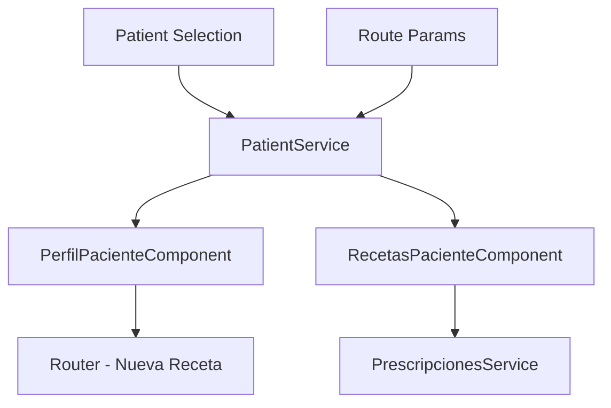

# Design Document

## Overview

Este documento describe el diseño para la actualización de las vistas de perfil del paciente y recetas del paciente en Angular, basándose en el diseño moderno del archivo React `PorMigrar/pages/PacientesPage.tsx`. La actualización incluye mejoras visuales significativas, mejor organización de la información, funcionalidades adicionales y integración con los componentes existentes de Angular.

## Architecture

### Component Structure

```
src/app/pages/pacientes/
├── perfil/
│   ├── perfil.component.ts (actualizado)
│   ├── perfil.component.html (nuevo)
│   └── perfil.component.css (nuevo)
└── recetas/
    ├── recetas.component.ts (actualizado)
    ├── recetas.component.html (nuevo)
    └── recetas.component.css (nuevo)
```

### Data Flow



### Integration Points

- **PatientService**: Fuente de datos de pacientes existente
- **Router**: Navegación a `/prescripciones/nueva` con paciente preseleccionado
- **LucideAngularModule**: Iconos existentes
- **Tailwind CSS**: Estilos existentes
- **Modales existentes**: Reutilización de componentes de modal

## Components and Interfaces

### 1. PerfilPacienteComponent (Actualizado)

#### Template Structure
```html
<div class="space-y-6">
  <!-- Header Visual con Gradiente -->
  <div class="relative overflow-hidden bg-gradient-to-r from-blue-600 via-indigo-500 to-blue-700 rounded-lg shadow-lg">
    <!-- Información del paciente y estadísticas -->
  </div>

  <!-- Cards de Información -->
  <div class="grid gap-6 lg:grid-cols-3">
    <!-- Información Personal (2 columnas) -->
    <!-- Información Médica (1 columna) -->
  </div>

  <!-- Alertas Médicas -->
  <div class="grid gap-4 md:grid-cols-2">
    <!-- Alergias Conocidas -->
    <!-- Condiciones Crónicas -->
  </div>

  <!-- Acciones Rápidas -->
  <div class="flex gap-4">
    <!-- Botón Nueva Receta -->
    <!-- Otros botones de acción -->
  </div>

  <!-- Historial Reciente -->
  <div class="bg-white rounded-lg shadow p-6">
    <!-- Tabla de recetas recientes -->
  </div>
</div>
```

#### Key Features
- **Header visual**: Gradiente azul con información del paciente y avatar
- **Estadísticas visuales**: Cards con números grandes para recetas totales/activas
- **Alertas médicas**: Badges distintivos para alergias (rojo) y condiciones crónicas (naranja)
- **Botón Nueva Receta**: Navegación directa a `/prescripciones/nueva`
- **Layout responsive**: Grid adaptativo para diferentes pantallas

#### Data Interface
```typescript
interface PatientProfileData extends PatientData {
  totalPrescriptions: number;
  activePrescriptions: number;
  recentPrescriptions: PrescriptionSummary[];
  medicalAlerts: {
    allergies: MedicalAlert[];
    chronicConditions: MedicalAlert[];
  };
}

interface MedicalAlert {
  name: string;
  severity: 'high' | 'medium' | 'low';
  dateAdded: string;
}
```

### 2. RecetasPacienteComponent (Actualizado)

#### Template Structure
```html
<div class="space-y-6">
  <!-- Header del Paciente -->
  <div class="bg-gradient-to-r from-blue-600 to-indigo-600 rounded-lg shadow-lg p-6">
    <!-- Información básica del paciente -->
  </div>

  <!-- Estadísticas de Recetas -->
  <div class="grid grid-cols-2 md:grid-cols-4 gap-4">
    <!-- Cards con estadísticas -->
  </div>

  <!-- Filtros y Búsqueda -->
  <div class="bg-white rounded-lg shadow p-6">
    <!-- Controles de filtrado -->
  </div>

  <!-- Lista de Recetas -->
  <div class="space-y-4">
    <!-- Cards de recetas individuales -->
  </div>

  <!-- Paginación -->
  <div class="flex justify-center">
    <!-- Controles de paginación -->
  </div>
</div>
```

#### Key Features
- **Header del paciente**: Información básica con foto/avatar
- **Estadísticas visuales**: Total, dispensadas, pendientes, vencidas
- **Cards de recetas**: Diseño moderno con información organizada
- **Estados visuales**: Badges de colores para diferentes estados
- **Filtros avanzados**: Por fecha, estado, médico
- **Acciones por receta**: Ver, reimprimir, exportar

#### Data Interface
```typescript
interface PrescriptionSummary {
  id: string;
  date: string;
  doctor: {
    name: string;
    specialty: string;
  };
  medications: MedicationSummary[];
  status: 'dispensed' | 'pending' | 'expired' | 'cancelled';
  diagnosis: string;
  notes?: string;
}

interface MedicationSummary {
  name: string;
  dosage: string;
  frequency: string;
  duration: string;
}
```

## Data Models

### Enhanced Patient Data
```typescript
// Extensión de la interfaz PatientData existente
interface EnhancedPatientData extends PatientData {
  // Estadísticas calculadas
  statistics: {
    totalPrescriptions: number;
    activePrescriptions: number;
    lastVisitDays: number;
    averageVisitsPerMonth: number;
  };
  
  // Alertas médicas organizadas
  medicalAlerts: {
    allergies: MedicalAlert[];
    chronicConditions: MedicalAlert[];
    criticalNotes: string[];
  };
  
  // Información de contacto mejorada
  contactInfo: {
    primaryPhone: string;
    secondaryPhone?: string;
    email?: string;
    emergencyContact?: EmergencyContact;
  };
  
  // Información de seguro mejorada
  insurance: {
    provider: string;
    number: string;
    type: string;
    validUntil?: string;
  };
}
```

### Prescription History Data
```typescript
interface PrescriptionHistory {
  prescriptions: PrescriptionSummary[];
  totalCount: number;
  statistics: {
    totalPrescriptions: number;
    dispensedCount: number;
    pendingCount: number;
    expiredCount: number;
    cancelledCount: number;
    averagePerMonth: number;
  };
  filters: {
    dateRange: DateRange;
    status: PrescriptionStatus[];
    doctors: string[];
  };
}
```

## Error Handling

### Patient Data Validation
```typescript
class PatientDataValidator {
  static validateForProfile(patient: PatientData): ValidationResult {
    // Validación específica para vista de perfil
  }
  
  static validateMedicalAlerts(alerts: MedicalAlert[]): ValidationResult {
    // Validación de alertas médicas
  }
}
```

### Error States
- **Paciente no encontrado**: Mensaje amigable con opción de búsqueda
- **Datos incompletos**: Alertas visuales para campos faltantes
- **Error de carga**: Skeleton loaders durante la carga
- **Sin recetas**: Estado vacío con ilustración y call-to-action

## Testing Strategy

### Unit Tests
```typescript
describe('PerfilPacienteComponent', () => {
  it('should display patient information correctly');
  it('should show medical alerts with proper styling');
  it('should navigate to new prescription on button click');
  it('should handle missing patient data gracefully');
});

describe('RecetasPacienteComponent', () => {
  it('should display prescription history');
  it('should filter prescriptions by status');
  it('should handle empty prescription list');
  it('should export prescription data');
});
```

### Integration Tests
- Navegación entre vistas de paciente
- Integración con PatientService
- Funcionalidad de filtros y búsqueda
- Exportación de datos

### Visual Regression Tests
- Responsive design en diferentes pantallas
- Estados de carga y error
- Temas de color y accesibilidad

## Implementation Approach

### Phase 1: Component Structure
1. Actualizar templates de componentes existentes
2. Implementar nuevos layouts con Tailwind CSS
3. Integrar iconos de Lucide Angular

### Phase 2: Data Integration
1. Extender interfaces de datos existentes
2. Actualizar servicios para nuevas funcionalidades
3. Implementar cálculo de estadísticas

### Phase 3: Interactive Features
1. Implementar navegación a nueva receta
2. Agregar filtros y búsqueda avanzada
3. Implementar exportación de datos

### Phase 4: Polish & Testing
1. Optimizar rendimiento
2. Implementar tests unitarios
3. Validar accesibilidad y responsive design

## Technical Considerations

### Performance
- **Lazy loading**: Cargar datos de recetas bajo demanda
- **Virtual scrolling**: Para listas largas de recetas
- **Memoization**: Cache de cálculos de estadísticas
- **Image optimization**: Avatars y fotos de pacientes

### Accessibility
- **ARIA labels**: Para elementos interactivos
- **Keyboard navigation**: Navegación completa por teclado
- **Screen reader support**: Descripciones apropiadas
- **Color contrast**: Cumplimiento WCAG 2.1 AA

### Security
- **Data sanitization**: Validación de datos de entrada
- **Permission checks**: Verificar permisos de acceso
- **Audit logging**: Registro de accesos a datos sensibles
- **HIPAA compliance**: Cumplimiento de normativas de privacidad

### Browser Compatibility
- **Modern browsers**: Chrome 90+, Firefox 88+, Safari 14+
- **Responsive design**: Móvil, tablet, desktop
- **Progressive enhancement**: Funcionalidad básica sin JavaScript