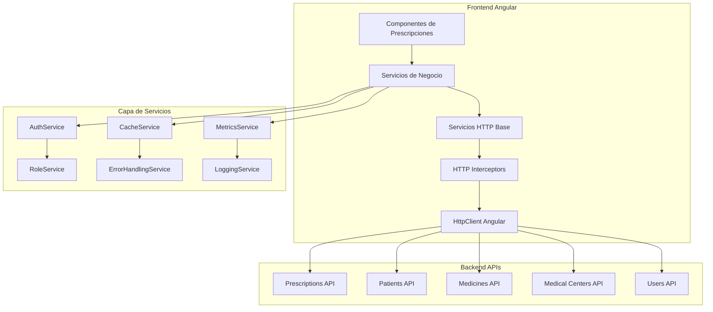
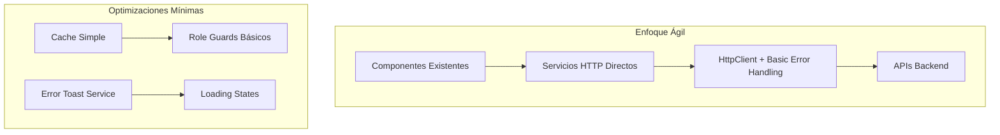

# Documento de Diseño

## Overview

Este documento describe el diseño técnico para la integración de servicios reales y eliminación de datos mock en las 6 vistas principales del módulo de Prescripciones. El diseño se basa en una arquitectura de servicios Angular con HttpClient, implementando patrones de caché, manejo de errores robusto y control de acceso basado en roles.

La solución reemplazará completamente los datos mock actuales con servicios HTTP que consuman APIs backend reales, manteniendo la funcionalidad existente mientras mejora el rendimiento y la seguridad.

## Architecture

### Arquitectura General



### Patrón de Servicios por Dominio

Cada vista tendrá su servicio especializado que extiende de un servicio base común:

- `PrescriptionService` - Gestión de prescripciones
- `DraftService` - Manejo de borradores
- `SearchService` - Búsqueda y filtrado
- `MedicalCenterService` - Gestión de centros médicos
- `BaseHttpService` - Funcionalidad común HTTP

## Components and Interfaces

### Servicios Principales

#### 1. BaseHttpService
```typescript
abstract class BaseHttpService<T> {
  protected baseUrl: string;
  protected cache: Map<string, CachedData<T>>;
  
  abstract getEndpoint(): string;
  
  protected get<R>(url: string, options?: HttpOptions): Observable<R>
  protected post<R>(url: string, body: any, options?: HttpOptions): Observable<R>
  protected put<R>(url: string, body: any, options?: HttpOptions): Observable<R>
  protected delete<R>(url: string, options?: HttpOptions): Observable<R>
  
  protected handleError(error: HttpErrorResponse): Observable<never>
  protected cacheResponse<R>(key: string, response: R, ttl?: number): void
  protected getCachedResponse<R>(key: string): R | null
}
```

#### 2. PrescriptionService
```typescript
class PrescriptionService extends BaseHttpService<Prescription> {
  // Eliminar datos mock actuales
  // Implementar métodos HTTP reales
  
  getPrescriptions(filters?: PrescriptionFilters): Observable<PaginatedResponse<Prescription>>
  createPrescription(prescription: CreatePrescriptionDto): Observable<Prescription>
  updatePrescription(id: string, updates: UpdatePrescriptionDto): Observable<Prescription>
  deletePrescription(id: string): Observable<void>
  
  // Métodos específicos por rol
  getPrescriptionsByRole(role: UserRole, userId: string): Observable<Prescription[]>
  validatePrescriptionAccess(prescriptionId: string, userId: string): Observable<boolean>
}
```

#### 3. DraftService
```typescript
class DraftService extends BaseHttpService<Draft> {
  getDrafts(userId: string, pagination: PaginationParams): Observable<PaginatedResponse<Draft>>
  saveDraft(draft: SaveDraftDto): Observable<Draft>
  deleteDraft(id: string): Observable<void>
  duplicateDraft(id: string): Observable<Draft>
  
  // Auto-save functionality
  autoSaveDraft(draft: Draft): Observable<void>
  getAutoSaveInterval(): number
}
```

### Interfaces de Datos

#### Prescription Interface
```typescript
interface Prescription {
  id: string;
  patientId: string;
  doctorId: string;
  medicalCenterId: string;
  medicines: Medicine[];
  status: PrescriptionStatus;
  createdAt: Date;
  updatedAt: Date;
  signedAt?: Date;
  digitalSignature?: DigitalSignature;
}

interface CreatePrescriptionDto {
  patientId: string;
  medicines: MedicineDto[];
  diagnosis: string;
  observations?: string;
}
```

#### Role-based Access Control
```typescript
interface RolePermissions {
  canCreate: boolean;
  canRead: boolean;
  canUpdate: boolean;
  canDelete: boolean;
  canViewAll: boolean;
  canSupervise: boolean;
}

interface UserRole {
  name: 'Médico' | 'Farmacéutico' | 'Enfermera' | 'Médico Jefe' | 'Administrador';
  permissions: RolePermissions;
  restrictions: string[];
}
```

## Data Models

### Modelo de Caché
```typescript
interface CachedData<T> {
  data: T;
  timestamp: number;
  ttl: number; // Time to live in milliseconds
  key: string;
}

interface CacheConfig {
  prescriptions: { ttl: 300000 }; // 5 minutos
  medicines: { ttl: 3600000 };    // 1 hora
  patients: { ttl: 1800000 };     // 30 minutos
  medicalCenters: { ttl: 86400000 }; // 24 horas
}
```

### Modelo de Paginación
```typescript
interface PaginationParams {
  page: number;
  limit: number;
  sortBy?: string;
  sortOrder?: 'asc' | 'desc';
}

interface PaginatedResponse<T> {
  data: T[];
  total: number;
  page: number;
  limit: number;
  totalPages: number;
}
```

### Modelo de Filtros
```typescript
interface PrescriptionFilters {
  status?: PrescriptionStatus[];
  dateFrom?: Date;
  dateTo?: Date;
  patientId?: string;
  doctorId?: string;
  medicalCenterId?: string;
  searchTerm?: string;
}
```

## Error Handling

### Estrategia de Manejo de Errores

#### 1. HTTP Error Interceptor
```typescript
class HttpErrorInterceptor implements HttpInterceptor {
  intercept(req: HttpRequest<any>, next: HttpHandler): Observable<HttpEvent<any>> {
    return next.handle(req).pipe(
      retry(3), // Reintentos automáticos
      catchError((error: HttpErrorResponse) => {
        return this.handleError(error);
      })
    );
  }
  
  private handleError(error: HttpErrorResponse): Observable<never> {
    // Log error
    // Show user-friendly message
    // Implement fallback strategies
  }
}
```

#### 2. Offline Mode Strategy
```typescript
class OfflineService {
  isOnline$: Observable<boolean>;
  
  handleOfflineMode(): void {
    // Implementar funcionalidad limitada offline
    // Usar datos en caché
    // Mostrar indicadores de estado offline
  }
  
  syncWhenOnline(): void {
    // Sincronizar datos pendientes cuando vuelva la conexión
  }
}
```

### Tipos de Errores y Respuestas

| Error Type | HTTP Code | User Message | Action |
|------------|-----------|--------------|---------|
| Network Error | 0 | "Sin conexión a internet" | Modo offline |
| Unauthorized | 401 | "Sesión expirada" | Redirect to login |
| Forbidden | 403 | "Sin permisos suficientes" | Show role suggestion |
| Not Found | 404 | "Recurso no encontrado" | Return to list |
| Server Error | 500 | "Error del servidor" | Retry with exponential backoff |
| Timeout | 408 | "Tiempo de espera agotado" | Retry option |

## Testing Strategy

### Estrategia de Pruebas por Capas

#### 1. Unit Tests
- **Servicios HTTP**: Mockear HttpClient, probar lógica de negocio
- **Componentes**: Mockear servicios, probar interacciones UI
- **Interceptors**: Probar manejo de errores y reintentos
- **Cache Service**: Probar TTL, invalidación, y limpieza

#### 2. Integration Tests
- **API Integration**: Probar contra APIs mock o staging
- **Role-based Access**: Verificar permisos por rol
- **Error Scenarios**: Simular fallos de red y timeouts
- **Performance**: Medir tiempos de carga y caché

#### 3. E2E Tests
- **User Workflows**: Flujos completos por rol
- **Offline Scenarios**: Comportamiento sin conexión
- **Error Recovery**: Recuperación después de errores
- **Cross-browser**: Compatibilidad entre navegadores

### Test Data Strategy
```typescript
// Mock data para testing
const mockPrescriptionService = {
  getPrescriptions: jasmine.createSpy().and.returnValue(of(mockPrescriptions)),
  createPrescription: jasmine.createSpy().and.returnValue(of(mockPrescription))
};

// Test utilities
class TestDataBuilder {
  static createPrescription(overrides?: Partial<Prescription>): Prescription
  static createDraft(overrides?: Partial<Draft>): Draft
  static createUser(role: UserRole): User
}
```

## Performance Optimizations

### Estrategias de Optimización

#### 1. Lazy Loading
- Cargar vistas bajo demanda
- Implementar virtual scrolling para listas grandes
- Paginación inteligente con prefetch

#### 2. Caching Strategy
```typescript
class CacheService {
  // Cache en memoria para datos frecuentes
  private memoryCache = new Map<string, CachedData<any>>();
  
  // Cache persistente para datos estáticos
  private persistentCache = new Map<string, CachedData<any>>();
  
  get<T>(key: string): T | null
  set<T>(key: string, data: T, ttl: number): void
  invalidate(pattern: string): void
  clear(): void
}
```

#### 3. Request Optimization
- Debounce para búsquedas (300ms)
- Cancelación de requests obsoletos
- Batch requests cuando sea posible
- Compression para responses grandes

### Métricas de Performance

| Métrica | Target | Measurement |
|---------|--------|-------------|
| Initial Load | < 2s | Time to interactive |
| Search Results | < 3s | API response + render |
| Page Navigation | < 1s | Route change completion |
| Cache Hit Rate | > 80% | Cache hits / total requests |
| Error Rate | < 1% | Failed requests / total requests |

## Security Considerations

### Autenticación y Autorización
- JWT tokens para autenticación
- Role-based access control (RBAC)
- Validación de permisos en cada request
- Refresh token automático

### Protección de Datos
- Sanitización de inputs
- Validación de datos en frontend y backend
- Encriptación de datos sensibles
- Audit logs para operaciones críticas

### API Security
- HTTPS obligatorio
- Rate limiting
- CORS configuration
- Input validation y sanitization

## Migration Strategy

### Opción 1: Implementación Completa (10 semanas)

#### Fase 1: Infraestructura Base (Semana 1-2)
- Implementar BaseHttpService
- Configurar interceptors
- Crear interfaces y modelos de datos
- Setup de testing framework

#### Fase 2: Servicios Core (Semana 3-4)
- Migrar PrescriptionService
- Implementar DraftService
- Configurar cache y error handling
- Tests unitarios

#### Fase 3: Vistas Principales (Semana 5-6)
- Migrar Vista_Nueva_Receta
- Migrar Vista_Mis_Borradores
- Migrar Vista_Recetas_Emitidas
- Tests de integración

#### Fase 4: Funcionalidades Avanzadas (Semana 7-8)
- Migrar Vista_Buscar_Receta
- Migrar Vista_Duplicar_Receta
- Migrar Vista_Centros_Medicos
- Implementar métricas y monitoreo

#### Fase 5: Optimización y Deploy (Semana 9-10)
- Performance tuning
- Tests E2E completos
- Documentation
- Production deployment

### Opción 2: Implementación Ágil Reducida (5-6 semanas)

#### Diseño Simplificado para Reducción de Tiempo

**Principios de Optimización:**
- Reutilizar patrones existentes del código actual
- Implementación incremental sin refactoring completo
- Priorizar funcionalidad core sobre optimizaciones avanzadas
- Testing básico pero efectivo

#### Arquitectura Simplificada



#### Sprint 1: Base HTTP (Semana 1)
**Objetivo:** Reemplazar servicios mock con HTTP básico
- Crear `HttpPrescriptionService` simple extendiendo servicios existentes
- Implementar métodos HTTP básicos (GET, POST, PUT, DELETE)
- Error handling básico con toast notifications
- **Estimación:** 5 días

**Tareas específicas:**
- Modificar `PrescripcionesService` para usar HttpClient
- Crear `environment.ts` con URLs de API
- Implementar error interceptor básico
- Actualizar `Vista_Nueva_Receta` para usar HTTP service

#### Sprint 2: Vistas Core (Semana 2)
**Objetivo:** Migrar las 3 vistas principales
- Actualizar `Vista_Mis_Borradores` con paginación básica
- Migrar `Vista_Recetas_Emitidas` con filtros simples
- Implementar loading states y error messages
- **Estimación:** 5 días

**Tareas específicas:**
- Reemplazar arrays mock con llamadas HTTP
- Implementar paginación simple (sin cache avanzado)
- Agregar spinners de carga
- Manejo básico de errores 404/500

#### Sprint 3: Búsqueda y Roles (Semana 3)
**Objetivo:** Funcionalidad de búsqueda y control básico de roles
- Migrar `Vista_Buscar_Receta` con debounce simple
- Implementar filtros por rol usando `RoleDemoService` existente
- Validaciones básicas de permisos
- **Estimación:** 5 días

**Tareas específicas:**
- Implementar búsqueda con debounce de 500ms
- Usar `RoleDemoService` para filtrar datos por rol
- Agregar guards básicos en rutas
- Validar permisos en servicios

#### Sprint 4: Funcionalidades Restantes (Semana 4)
**Objetivo:** Completar vistas restantes
- Migrar `Vista_Duplicar_Receta` con validaciones básicas
- Actualizar `Vista_Centros_Medicos` con CRUD simple
- Implementar cache básico en localStorage
- **Estimación:** 5 días

**Tareas específicas:**
- Implementar duplicación con validación de permisos
- CRUD básico para centros médicos
- Cache simple con localStorage (TTL básico)
- Validaciones de formularios

#### Sprint 5: Testing y Optimización (Semana 5)
**Objetivo:** Testing básico y optimizaciones mínimas
- Tests unitarios para servicios HTTP
- Tests de integración básicos
- Optimizaciones de performance simples
- **Estimación:** 5 días

**Tareas específicas:**
- Tests con jasmine para servicios principales
- Mock de HttpClient en tests
- Lazy loading básico para listas grandes
- Compresión de requests grandes

#### Sprint 6: Deploy y Monitoreo (Semana 6 - Opcional)
**Objetivo:** Deployment y monitoreo básico
- Configuración de producción
- Monitoreo básico de errores
- Documentation mínima
- **Estimación:** 3-5 días

### Comparación de Enfoques

| Aspecto | Opción 1 (Completa) | Opción 2 (Ágil) |
|---------|---------------------|------------------|
| **Tiempo** | 10 semanas | 5-6 semanas |
| **Complejidad** | Alta | Media |
| **Mantenibilidad** | Excelente | Buena |
| **Performance** | Óptima | Aceptable |
| **Testing** | Completo | Básico pero efectivo |
| **Escalabilidad** | Muy alta | Media |
| **Riesgo** | Bajo | Medio |

### Estimaciones de Tiempo por Vista (Opción Ágil)

| Vista | Tiempo Estimado | Complejidad | Notas |
|-------|----------------|-------------|-------|
| **Nueva Receta** | 1.5 días | Media | Reemplazar selects mock, validaciones básicas |
| **Mis Borradores** | 1 día | Baja | Paginación simple, CRUD básico |
| **Recetas Emitidas** | 1 día | Baja | Lista con filtros, sin cache avanzado |
| **Buscar Receta** | 1.5 días | Media | Búsqueda con debounce, filtros por rol |
| **Duplicar Receta** | 1 día | Media | Validaciones de permisos, copia de datos |
| **Centros Médicos** | 1 día | Baja | CRUD simple, validaciones básicas |

### Rollback Strategy (Ambas Opciones)
- Feature flags para activar/desactivar nuevos servicios
- Mantener servicios mock como fallback
- Monitoreo en tiempo real post-deployment
- Plan de rollback automático si error rate > 5%

### Recomendación
**Para reducción de tiempo:** Opción 2 (Ágil) es recomendada si:
- Se necesita delivery rápido
- El equipo tiene experiencia con Angular/HTTP
- Se puede iterar y mejorar después del MVP
- Los requerimientos de performance son moderados

**Para proyecto a largo plazo:** Opción 1 (Completa) es mejor si:
- Se requiere máxima escalabilidad
- Performance es crítica
- Se necesita arquitectura robusta desde el inicio
- Hay tiempo suficiente para implementación completa