# Arquitectura Completa del Sistema ePrescription

## 1. Arquitectura General del Sistema

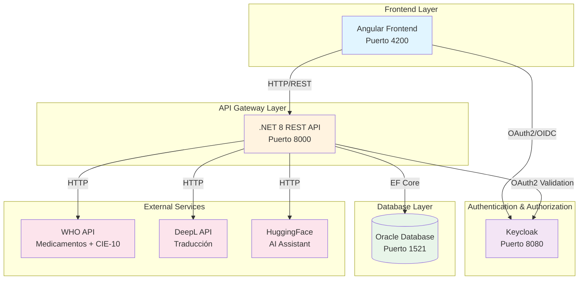

## 2. Arquitectura Clean Architecture del Backend

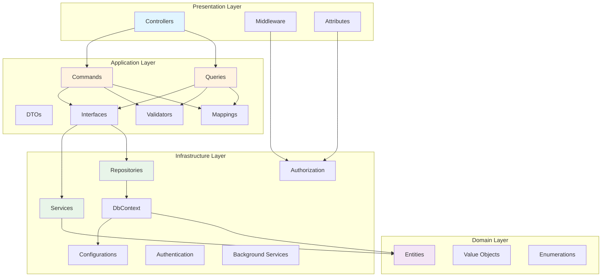

## 3. Flujo de Autenticación y Autorización

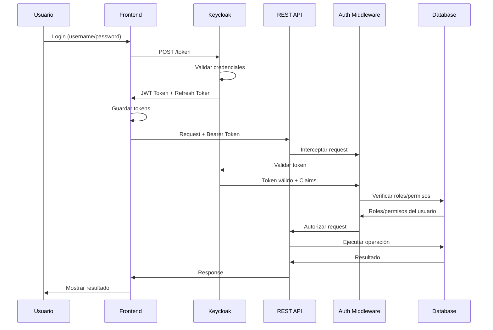

## 4. Arquitectura de Datos - Modelo Entidad-Relación

### Diagrama Simplificado por Módulos

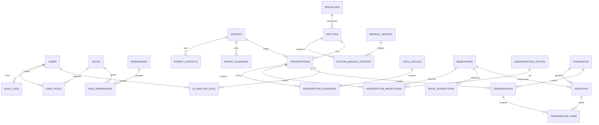

**Nota**: Para un diagrama más detallado con todos los campos de cada entidad, consultar `docs/DIAGRAMA-ER-MEJORADO.md`

## 5. Flujo de Creación de Prescripción

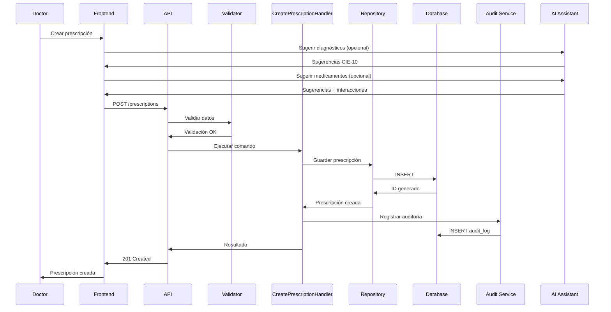

## 6. Flujo de Dispensación en Farmacia

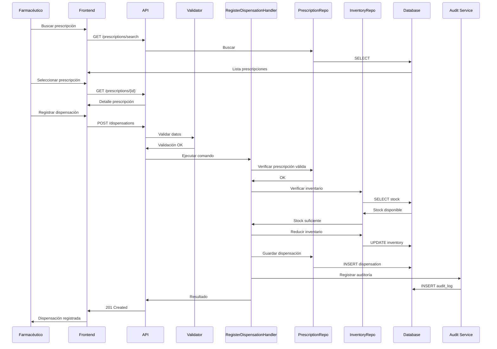

## 7. Arquitectura de Seguridad

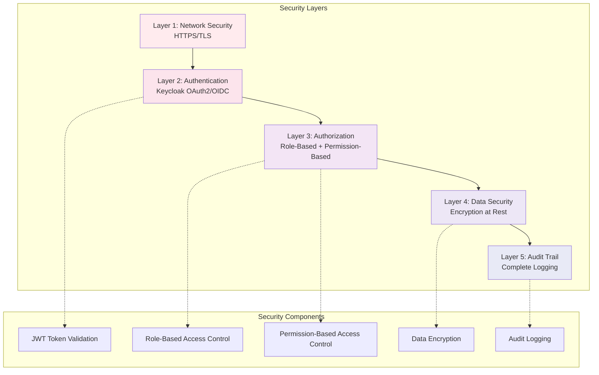

## 8. Componentes del Sistema

### 8.1 Frontend (Angular)

- **Tecnología**: Angular 18
- **Puerto**: 4200
- **Características**:
  - SPA (Single Page Application)
  - Routing con guards de autenticación
  - Servicios HTTP para comunicación con API
  - Gestión de estado con RxJS
  - UI con Tailwind CSS

### 8.2 Backend API (.NET 8)

- **Tecnología**: ASP.NET Core 8
- **Puerto**: 8000
- **Arquitectura**: Clean Architecture
- **Patrones**:
  - CQRS (Command Query Responsibility Segregation)
  - Repository Pattern
  - Mediator Pattern (MediatR)
  - Dependency Injection

### 8.3 Base de Datos (Oracle)

- **Tecnología**: Oracle Database 21c
- **Puerto**: 1521
- **Características**:
  - Esquema normalizado
  - Índices optimizados
  - Constraints de integridad referencial
  - Triggers para auditoría

### 8.4 Autenticación (Keycloak)

- **Tecnología**: Keycloak 23
- **Puerto**: 8080
- **Características**:
  - OAuth 2.0 / OpenID Connect
  - Gestión de usuarios y roles
  - Single Sign-On (SSO)
  - Token management

## 9. Integraciones Externas

### 9.1 WHO API
- **Propósito**: Catálogo internacional de medicamentos y diagnósticos CIE-10
- **Uso**: 
  - Búsqueda y sincronización de medicamentos
  - Búsqueda y sincronización de códigos CIE-10 (diagnósticos)
- **Frecuencia**: Sincronización diaria automática (1:00 AM)
- **Endpoints**:
  - `/medications` - Catálogo de medicamentos
  - `/icd-10` - Códigos CIE-10

### 9.2 DeepL API
- **Propósito**: Traducción de contenido médico
- **Uso**: Traducir nombres de medicamentos y diagnósticos
- **Límite**: 500,000 caracteres/mes

### 9.3 HuggingFace API
- **Propósito**: Asistente AI para sugerencias médicas
- **Uso**: Sugerir diagnósticos y medicamentos
- **Modelo**: Llama 3.2 3B Instruct

## 10. Despliegue con Docker

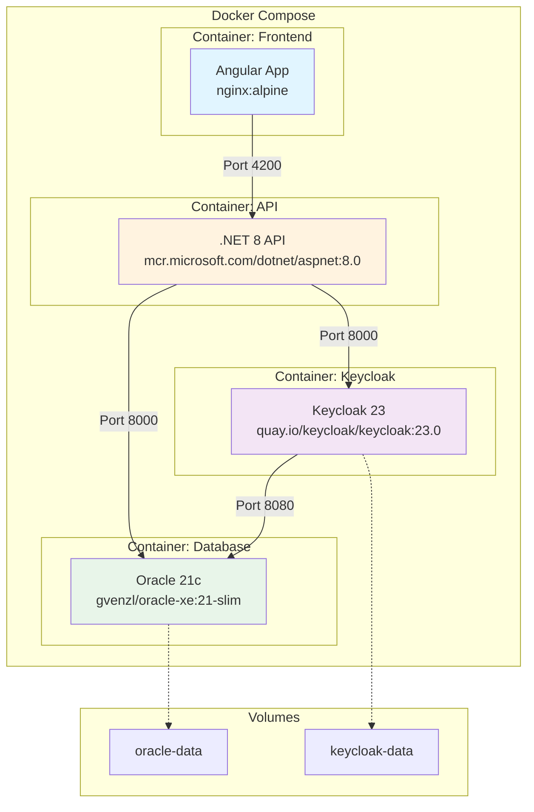

## 11. Flujo de Datos Completo

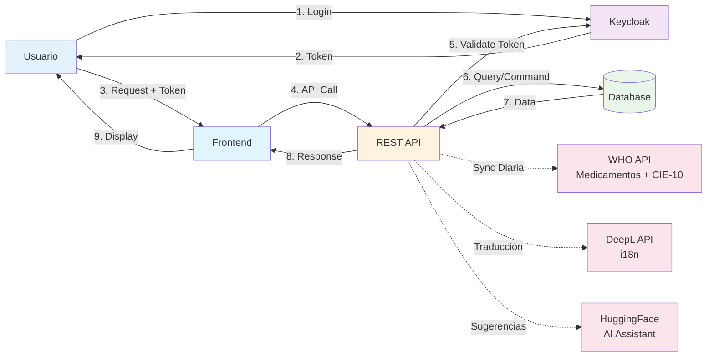

## 12. Resumen de Tecnologías

| Componente | Tecnología | Versión | Puerto |
|------------|-----------|---------|--------|
| Frontend | Angular | 18 | 4200 |
| Backend API | .NET Core | 8.0 | 8000 |
| Base de Datos | Oracle Database | 21c | 1521 |
| Autenticación | Keycloak | 23.0 | 8080 |
| ORM | Entity Framework Core | 8.0 | - |
| Contenedores | Docker | Latest | - |
| Orquestación | Docker Compose | Latest | - |

## 13. Flujo de Análisis de IA con Traducción

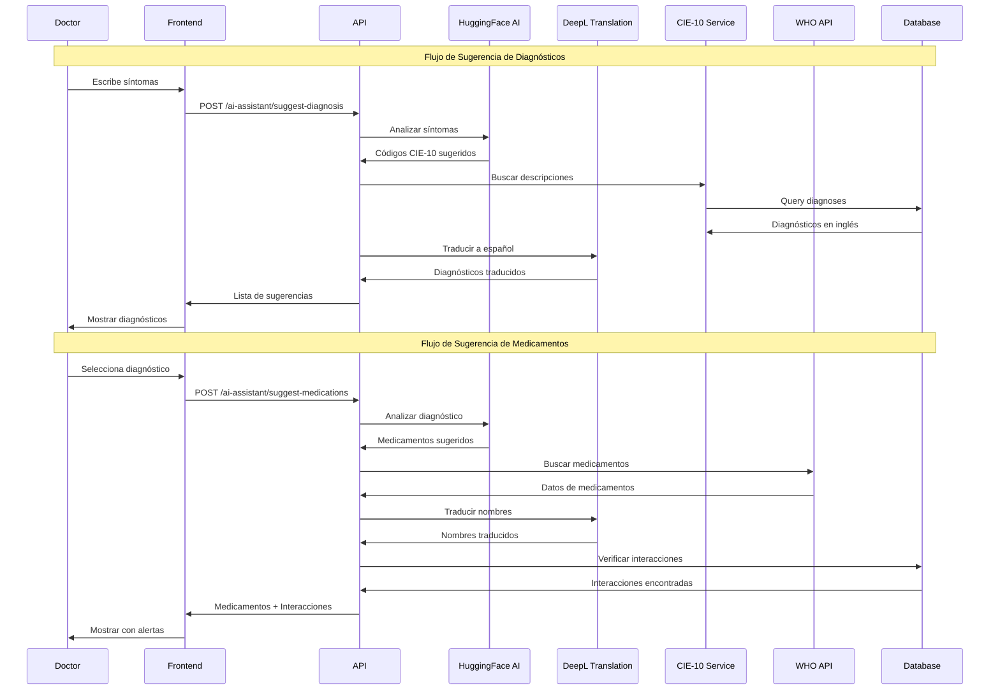

## 14. Integración WHO API y Translation Service

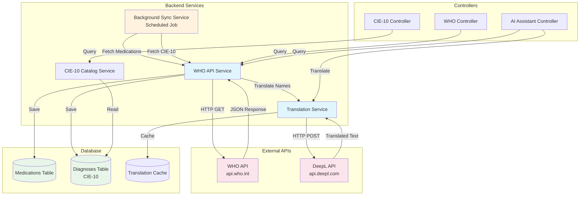

## 15. Proceso de Sincronización WHO (Background Service)

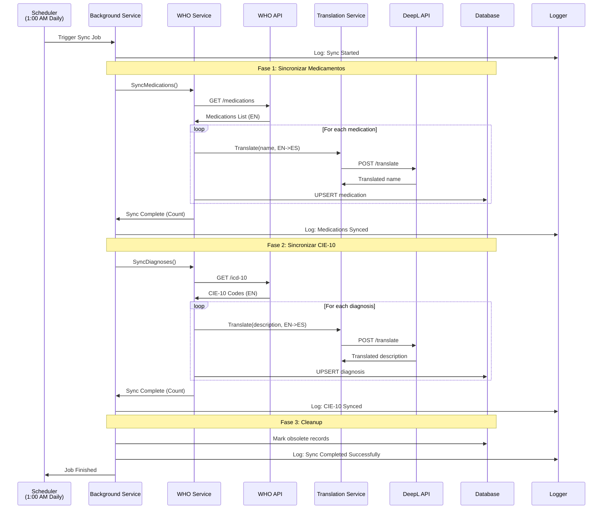

## 16. Patrones de Diseño Implementados

1. **Clean Architecture**: Separación en capas (Presentation, Application, Domain, Infrastructure)
2. **CQRS**: Separación de comandos y consultas
3. **Repository Pattern**: Abstracción de acceso a datos
4. **Mediator Pattern**: Desacoplamiento de handlers
5. **Dependency Injection**: Inversión de control
6. **Unit of Work**: Transacciones coordinadas
7. **Factory Pattern**: Creación de objetos complejos
8. **Strategy Pattern**: Diferentes estrategias de autenticación/autorización
