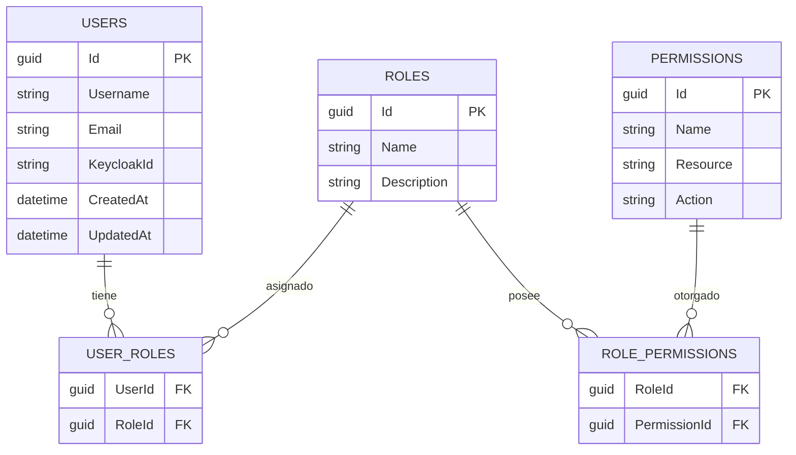
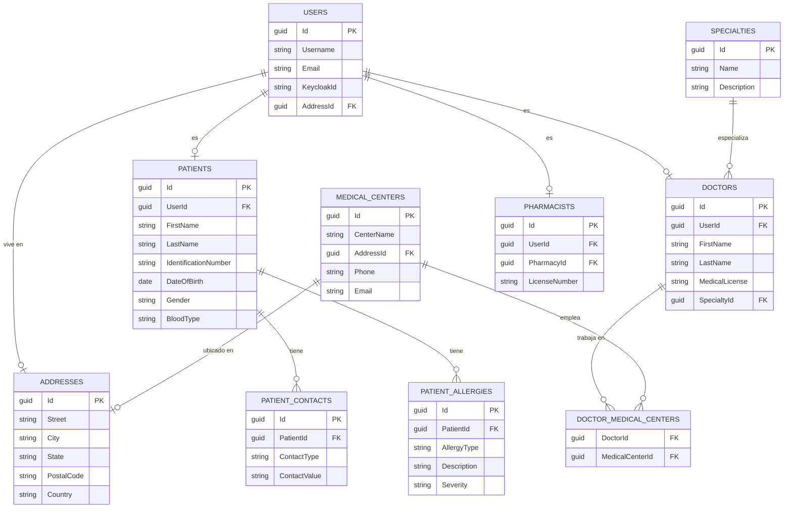
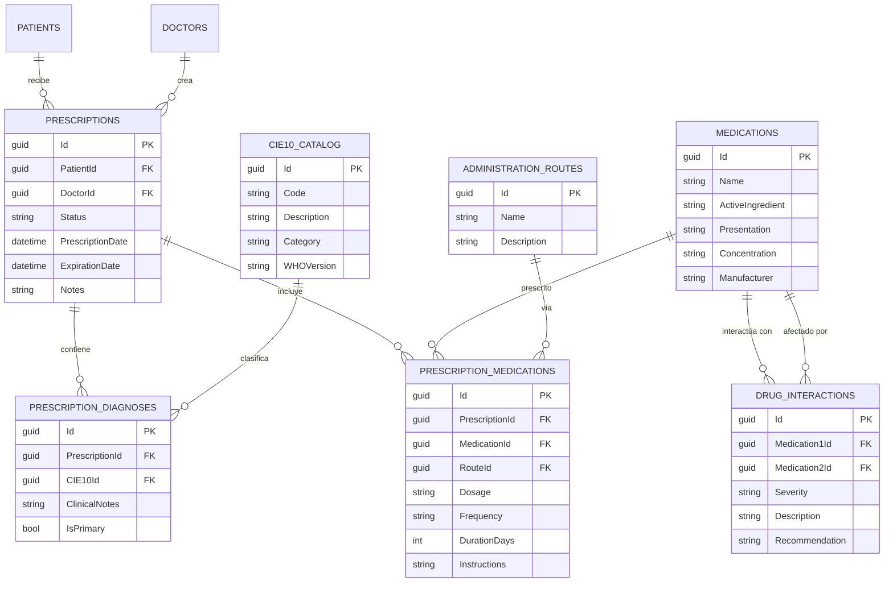
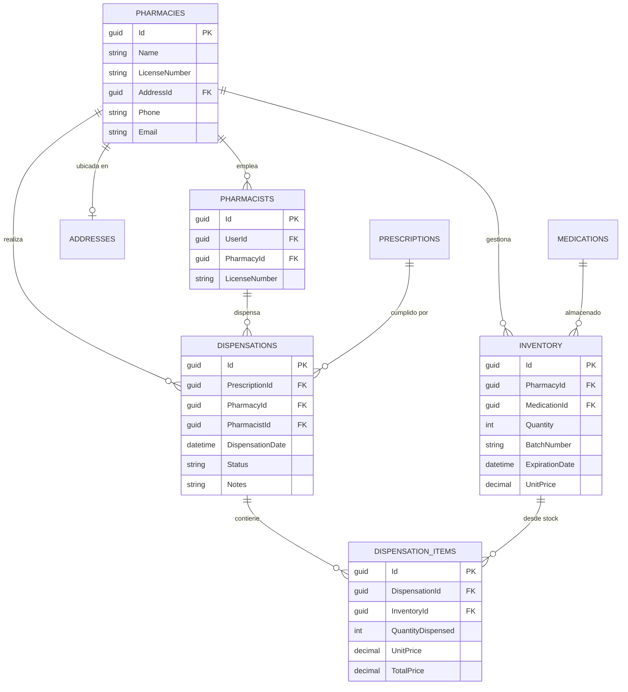
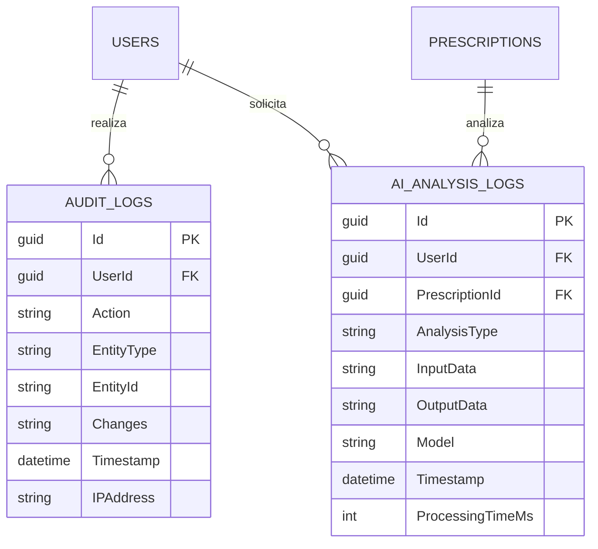
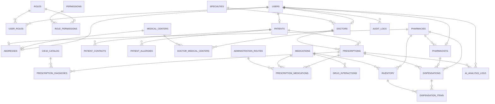
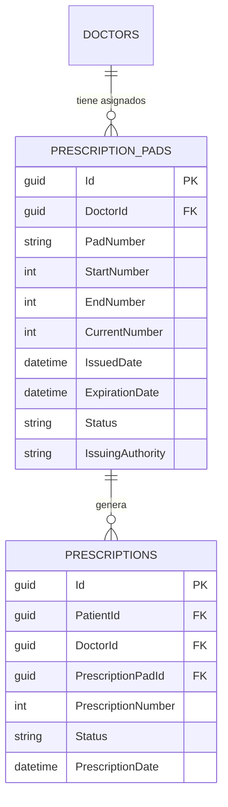
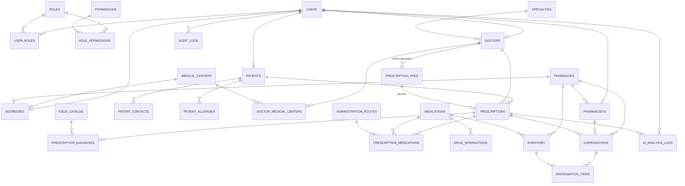

# Modelo Entidad-Relación (ERD) - ePrescription System

## Diagrama Simplificado por Módulos

Este documento presenta el modelo de datos organizado por módulos funcionales para mejor comprensión.

---

## 1. Módulo de Seguridad y Usuarios




## 2. Módulo de Entidades Médicas




## 3. Módulo de Prescripciones




## 4. Módulo de Farmacia y Dispensación




## 5. Módulo de Auditoría y AI



---

## Diagrama Completo Integrado



---

## Resumen de Entidades

| Módulo | Entidades | Total |
|--------|-----------|-------|
| Seguridad | USERS, ROLES, PERMISSIONS, USER_ROLES, ROLE_PERMISSIONS | 5 |
| Compartido | ADDRESSES | 1 |
| Médicas | PATIENTS, PATIENT_CONTACTS, PATIENT_ALLERGIES, DOCTORS, SPECIALTIES, MEDICAL_CENTERS, DOCTOR_MEDICAL_CENTERS, PHARMACISTS | 8 |
| Prescripciones | PRESCRIPTIONS, PRESCRIPTION_DIAGNOSES, PRESCRIPTION_MEDICATIONS, CIE10_CATALOG, MEDICATIONS, ADMINISTRATION_ROUTES, DRUG_INTERACTIONS | 7 |
| Farmacia | PHARMACIES, INVENTORY, DISPENSATIONS, DISPENSATION_ITEMS | 4 |
| Auditoría | AUDIT_LOGS, AI_ANALYSIS_LOGS | 2 |
| **TOTAL** | | **27** |

### Lista Completa de Entidades

**Módulo de Seguridad (5)**:
1. USERS
2. ROLES
3. PERMISSIONS
4. USER_ROLES
5. ROLE_PERMISSIONS

**Módulo Compartido (1)**:
6. ADDRESSES

**Módulo Médico (8)**:
7. PATIENTS
8. PATIENT_CONTACTS
9. PATIENT_ALLERGIES
10. DOCTORS
11. SPECIALTIES
12. MEDICAL_CENTERS
13. DOCTOR_MEDICAL_CENTERS
14. PHARMACISTS

**Módulo de Prescripciones (7)**:
15. PRESCRIPTIONS
16. PRESCRIPTION_DIAGNOSES
17. PRESCRIPTION_MEDICATIONS
18. CIE10_CATALOG (Catálogo CIE-10)
19. MEDICATIONS
20. ADMINISTRATION_ROUTES
21. DRUG_INTERACTIONS

**Módulo de Farmacia (4)**:
22. PHARMACIES
23. INVENTORY
24. DISPENSATIONS
25. DISPENSATION_ITEMS

**Módulo de Auditoría (2)**:
26. AUDIT_LOGS
27. AI_ANALYSIS_LOGS

---

## Notas de Diseño

### Normalización
- Todas las tablas están en 4NF/5NF
- No hay redundancia de datos
- Integridad referencial garantizada con FKs

### Índices Principales
- Todos los IDs son GUIDs (Primary Keys)
- Índices en campos de búsqueda frecuente (nombres, códigos, fechas)
- Índices compuestos en tablas de relación many-to-many

### Auditoría
- Todas las entidades principales tienen auditoría automática
- AUDIT_LOGS es inmutable (trigger en BD)
- Retención de 7 años según normativas

### Catálogo CIE-10
- Sincronización diaria con WHO API
- Búsqueda por código y descripción
- Versionado según WHO


---

## ACTUALIZACIÓN IMPORTANTE: Talonarios de Prescripciones

### Entidad Faltante Crítica: PRESCRIPTION_PADS (Talonarios)

Los talonarios son fundamentales para el control regulatorio de prescripciones. Un médico NO puede emitir prescripciones sin tener talonarios asignados y disponibles.



### Campos de PRESCRIPTION_PADS:

- **Id**: Identificador único del talonario
- **DoctorId**: Médico al que se le asignó el talonario
- **PadNumber**: Número del talonario (ej: "TAL-2024-001234")
- **StartNumber**: Número inicial del rango (ej: 1)
- **EndNumber**: Número final del rango (ej: 50)
- **CurrentNumber**: Número actual/siguiente a usar
- **IssuedDate**: Fecha de emisión del talonario
- **ExpirationDate**: Fecha de vencimiento
- **Status**: Estado (Active, Exhausted, Expired, Cancelled)
- **IssuingAuthority**: Autoridad que emitió el talonario

### Reglas de Negocio:

1. **Control de Numeración**: Cada prescripción debe tener un número único del talonario
2. **Validación Pre-Prescripción**: Antes de crear una prescripción, validar:
   - El médico tiene talonarios activos
   - El talonario no está vencido
   - Quedan números disponibles (CurrentNumber <= EndNumber)
3. **Incremento Automático**: Al crear una prescripción, incrementar CurrentNumber
4. **Estado Exhausted**: Cuando CurrentNumber > EndNumber, marcar como agotado
5. **Auditoría**: Registrar todas las asignaciones y usos de talonarios

### Impacto en PRESCRIPTIONS:

La tabla PRESCRIPTIONS debe agregar:
- **PrescriptionPadId**: FK al talonario usado
- **PrescriptionNumber**: Número específico dentro del talonario

---

## Resumen Actualizado con Talonarios

### Total de Entidades: 28 (no 27)

| Módulo | Entidades | Total |
|--------|-----------|-------|
| Seguridad | USERS, ROLES, PERMISSIONS, USER_ROLES, ROLE_PERMISSIONS | 5 |
| Compartido | ADDRESSES | 1 |
| Médicas | PATIENTS, PATIENT_CONTACTS, PATIENT_ALLERGIES, DOCTORS, SPECIALTIES, MEDICAL_CENTERS, DOCTOR_MEDICAL_CENTERS, PHARMACISTS | 8 |
| **Prescripciones** | PRESCRIPTIONS, **PRESCRIPTION_PADS**, PRESCRIPTION_DIAGNOSES, PRESCRIPTION_MEDICATIONS, CIE10_CATALOG, MEDICATIONS, ADMINISTRATION_ROUTES, DRUG_INTERACTIONS | **8** |
| Farmacia | PHARMACIES, INVENTORY, DISPENSATIONS, DISPENSATION_ITEMS | 4 |
| Auditoría | AUDIT_LOGS, AI_ANALYSIS_LOGS | 2 |
| **TOTAL** | | **28** |

### Lista Completa Actualizada:

**Módulo de Prescripciones (8)**:
15. PRESCRIPTIONS
16. **PRESCRIPTION_PADS** ← **NUEVA**
17. PRESCRIPTION_DIAGNOSES
18. PRESCRIPTION_MEDICATIONS
19. CIE10_CATALOG
20. MEDICATIONS
21. ADMINISTRATION_ROUTES
22. DRUG_INTERACTIONS

---

## Diagrama Completo Actualizado con Talonarios



---

## Nota Importante para Implementación

⚠️ **CRÍTICO**: La tabla PRESCRIPTION_PADS debe implementarse ANTES de permitir la creación de prescripciones en producción. Es un requisito regulatorio para:

1. **Trazabilidad**: Cada prescripción debe tener un número único rastreable
2. **Control**: Limitar la cantidad de prescripciones que un médico puede emitir
3. **Auditoría**: Cumplimiento con normativas de salud
4. **Seguridad**: Prevenir falsificación de prescripciones

### Validación Requerida en CreatePrescriptionCommand:

```csharp
// Pseudo-código de validación
1. Verificar que el doctor tiene talonarios activos
2. Verificar que el talonario no está vencido
3. Verificar que quedan números disponibles
4. Asignar número de prescripción del talonario
5. Incrementar CurrentNumber del talonario
6. Si CurrentNumber > EndNumber, marcar talonario como Exhausted
```
