# Diagrama Entidad-Relación - ePrescription

## Diagrama Visual (Mermaid)

Puedes visualizar este diagrama en:
- VS Code con la extensión "Markdown Preview Mermaid Support"
- GitHub (automáticamente)
- https://mermaid.live/ (pega el código)

```mermaid
erDiagram
    PATIENTS ||--o{ PATIENT_CONTACTS : "tiene"
    PATIENTS ||--o{ PATIENT_ALLERGIES : "tiene"
    PATIENTS ||--o{ PRESCRIPTIONS : "recibe"
    
    DOCTORS ||--o{ PRESCRIPTIONS : "emite"
    DOCTORS }o--|| SPECIALTIES : "pertenece"
    DOCTORS ||--o{ DOCTOR_MEDICAL_CENTERS : "trabaja_en"
    
    MEDICAL_CENTERS ||--o{ DOCTOR_MEDICAL_CENTERS : "emplea"
    MEDICAL_CENTERS }o--|| ADDRESSES : "ubicado_en"
    MEDICAL_CENTERS ||--o{ PRESCRIPTIONS : "emitida_en"
    
    PRESCRIPTIONS ||--o{ PRESCRIPTION_DIAGNOSES : "contiene"
    PRESCRIPTIONS ||--o{ PRESCRIPTION_MEDICATIONS : "contiene"
    PRESCRIPTIONS ||--o{ DISPENSATIONS : "dispensada_en"
    PRESCRIPTIONS ||--o{ AI_ANALYSIS_LOGS : "analizada_por"
    
    CIE10_CATALOG ||--o{ PRESCRIPTION_DIAGNOSES : "clasifica"
    
    MEDICATIONS ||--o{ PRESCRIPTION_MEDICATIONS : "prescrito_como"
    MEDICATIONS ||--o{ DRUG_INTERACTIONS : "interactua_con_1"
    MEDICATIONS ||--o{ DRUG_INTERACTIONS : "interactua_con_2"
    MEDICATIONS ||--o{ INVENTORY : "almacenado_en"
    
    ADMINISTRATION_ROUTES ||--o{ PRESCRIPTION_MEDICATIONS : "via"
    
    PHARMACIES ||--o{ INVENTORY : "mantiene"
    PHARMACIES ||--o{ DISPENSATIONS : "dispensa"
    PHARMACIES }o--|| ADDRESSES : "ubicada_en"
    
    DISPENSATIONS ||--o{ DISPENSATION_ITEMS : "contiene"
    
    DISPENSATION_ITEMS }o--|| PRESCRIPTION_MEDICATIONS : "de"
    DISPENSATION_ITEMS }o--|| INVENTORY : "desde"
    
    USERS ||--o{ USER_ROLES : "tiene"
    USERS ||--o{ AUDIT_LOGS : "realiza"
    USERS ||--o{ AI_ANALYSIS_LOGS : "solicita"
    USERS ||--o{ DISPENSATIONS : "farmaceutico"
    
    ROLES ||--o{ USER_ROLES : "asignado_a"
    ROLES ||--o{ ROLE_PERMISSIONS : "tiene"
    
    PERMISSIONS ||--o{ ROLE_PERMISSIONS : "otorgado_en"
    
    PATIENTS {
        RAW patient_id PK
        VARCHAR2 identification_number UK
        VARCHAR2 first_name
        VARCHAR2 last_name
        DATE date_of_birth
        VARCHAR2 gender
        VARCHAR2 blood_type
    }
    
    PATIENT_CONTACTS {
        RAW contact_id PK
        RAW patient_id FK
        VARCHAR2 contact_type
        VARCHAR2 contact_value
        NUMBER is_primary
    }
    
    PATIENT_ALLERGIES {
        RAW allergy_id PK
        RAW patient_id FK
        VARCHAR2 allergen_type
        VARCHAR2 allergen_name
        VARCHAR2 severity
    }
    
    DOCTORS {
        RAW doctor_id PK
        VARCHAR2 identification_number UK
        VARCHAR2 first_name
        VARCHAR2 last_name
        RAW specialty_id FK
        VARCHAR2 license_number UK
    }
    
    SPECIALTIES {
        RAW specialty_id PK
        VARCHAR2 specialty_code UK
        VARCHAR2 specialty_name
    }
    
    MEDICAL_CENTERS {
        RAW center_id PK
        VARCHAR2 center_name
        VARCHAR2 center_type
        RAW address_id FK
    }
    
    PRESCRIPTIONS {
        RAW prescription_id PK
        VARCHAR2 prescription_number UK
        RAW patient_id FK
        RAW doctor_id FK
        RAW medical_center_id FK
        TIMESTAMP prescription_date
        TIMESTAMP expiration_date
        VARCHAR2 status
    }
    
    CIE10_CATALOG {
        RAW cie10_id PK
        VARCHAR2 code UK
        VARCHAR2 description
        VARCHAR2 category
        VARCHAR2 subcategory
        NUMBER is_active
    }
    
    PRESCRIPTION_DIAGNOSES {
        RAW prescription_diagnosis_id PK
        RAW prescription_id FK
        RAW cie10_id FK
        VARCHAR2 diagnosis_code
        NUMBER is_primary
        NUMBER ai_suggested
        NUMBER ai_confidence_score
    }
    
    MEDICATIONS {
        RAW medication_id PK
        VARCHAR2 medication_code UK
        VARCHAR2 commercial_name
        VARCHAR2 generic_name
        VARCHAR2 active_ingredient
    }
    
    PRESCRIPTION_MEDICATIONS {
        RAW prescription_medication_id PK
        RAW prescription_id FK
        RAW medication_id FK
        VARCHAR2 dosage
        VARCHAR2 frequency
        NUMBER duration_days
        RAW administration_route_id FK
        NUMBER quantity
        NUMBER ai_suggested
    }
    
    ADMINISTRATION_ROUTES {
        RAW route_id PK
        VARCHAR2 route_code UK
        VARCHAR2 route_name
    }
    
    DRUG_INTERACTIONS {
        RAW interaction_id PK
        RAW medication_id_1 FK
        RAW medication_id_2 FK
        VARCHAR2 interaction_severity
    }
    
    PHARMACIES {
        RAW pharmacy_id PK
        VARCHAR2 pharmacy_name
        VARCHAR2 license_number UK
        RAW address_id FK
    }
    
    INVENTORY {
        RAW inventory_id PK
        RAW pharmacy_id FK
        RAW medication_id FK
        VARCHAR2 batch_number
        NUMBER quantity_available
        DATE expiration_date
    }
    
    DISPENSATIONS {
        RAW dispensation_id PK
        RAW prescription_id FK
        RAW pharmacy_id FK
        RAW pharmacist_id FK
        TIMESTAMP dispensation_date
        VARCHAR2 status
    }
    
    DISPENSATION_ITEMS {
        RAW dispensation_item_id PK
        RAW dispensation_id FK
        RAW prescription_medication_id FK
        RAW inventory_id FK
        NUMBER quantity_dispensed
    }
    
    USERS {
        RAW user_id PK
        VARCHAR2 username UK
        VARCHAR2 email UK
        VARCHAR2 keycloak_user_id UK
        NUMBER is_active
    }
    
    ROLES {
        RAW role_id PK
        VARCHAR2 role_name UK
        VARCHAR2 keycloak_role_id
    }
    
    PERMISSIONS {
        RAW permission_id PK
        VARCHAR2 permission_name UK
        VARCHAR2 resource_name
        VARCHAR2 action
    }
    
    USER_ROLES {
        RAW user_role_id PK
        RAW user_id FK
        RAW role_id FK
    }
    
    ROLE_PERMISSIONS {
        RAW role_permission_id PK
        RAW role_id FK
        RAW permission_id FK
    }
    
    ADDRESSES {
        RAW address_id PK
        VARCHAR2 street_address
        VARCHAR2 city
        VARCHAR2 state_province
        VARCHAR2 postal_code
    }
    
    AUDIT_LOGS {
        RAW audit_id PK
        TIMESTAMP timestamp
        RAW user_id FK
        VARCHAR2 action_type
        VARCHAR2 entity_type
        VARCHAR2 entity_id
    }
    
    AI_ANALYSIS_LOGS {
        RAW analysis_id PK
        TIMESTAMP timestamp
        RAW user_id FK
        RAW prescription_id FK
        VARCHAR2 analysis_type
        NUMBER confidence_score
        NUMBER was_accepted
    }
```

## Leyenda

- **PK**: Primary Key
- **FK**: Foreign Key
- **UK**: Unique Key
- **||--o{**: Relación uno a muchos
- **}o--||**: Relación muchos a uno
- **||--||**: Relación uno a uno

## Tablas por Módulo

### 🏥 Módulo de Pacientes
- PATIENTS
- PATIENT_CONTACTS
- PATIENT_ALLERGIES

### 👨‍⚕️ Módulo de Médicos
- DOCTORS
- SPECIALTIES
- MEDICAL_CENTERS
- DOCTOR_MEDICAL_CENTERS

### 📋 Módulo de Prescripciones
- PRESCRIPTIONS
- PRESCRIPTION_DIAGNOSES
- PRESCRIPTION_MEDICATIONS
- CIE10_CATALOG

### 💊 Módulo de Medicamentos
- MEDICATIONS
- ADMINISTRATION_ROUTES
- DRUG_INTERACTIONS

### 🏪 Módulo de Farmacias
- PHARMACIES
- INVENTORY
- DISPENSATIONS
- DISPENSATION_ITEMS

### 🔐 Módulo de Seguridad
- USERS
- ROLES
- PERMISSIONS
- USER_ROLES
- ROLE_PERMISSIONS

### 📊 Módulo de Auditoría
- AUDIT_LOGS (inmutable)
- AI_ANALYSIS_LOGS (inmutable)

### 📍 Módulo Compartido
- ADDRESSES

## Normalización

- **4NF**: PATIENT_CONTACTS, PRESCRIPTION_DIAGNOSES, PRESCRIPTION_MEDICATIONS, DISPENSATION_ITEMS
- **5NF**: DOCTOR_MEDICAL_CENTERS, DRUG_INTERACTIONS, USER_ROLES, ROLE_PERMISSIONS
